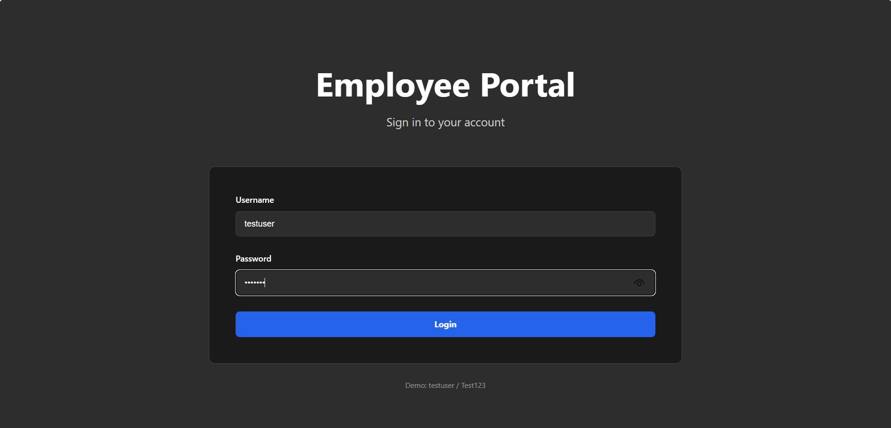
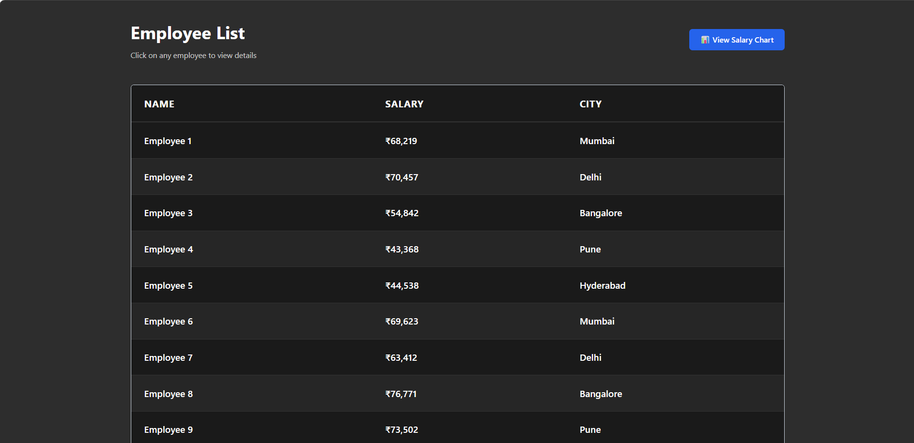
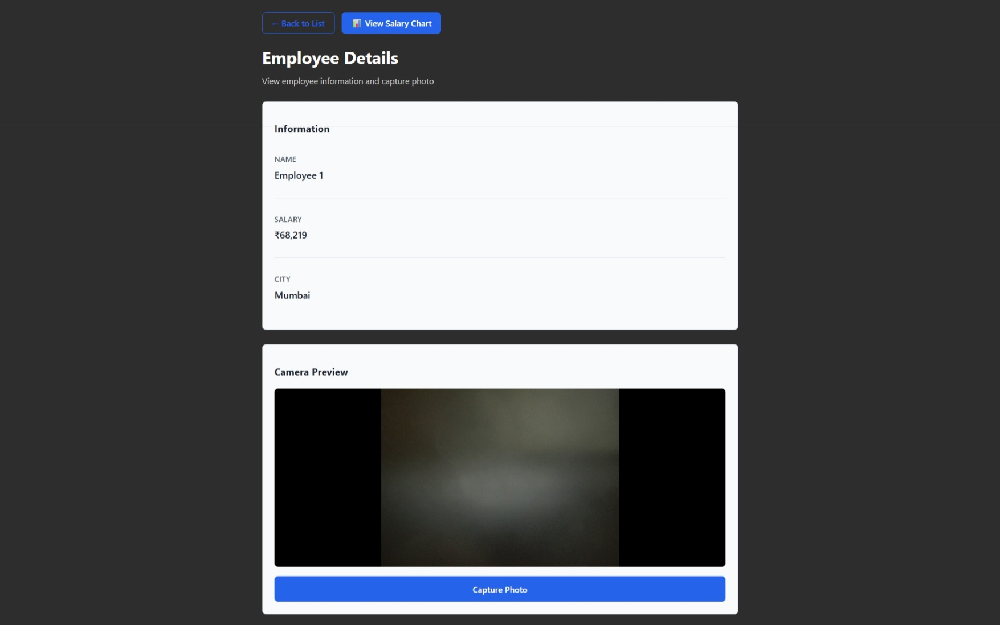
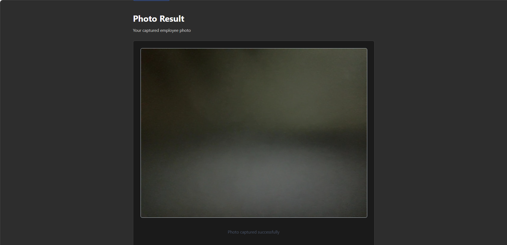
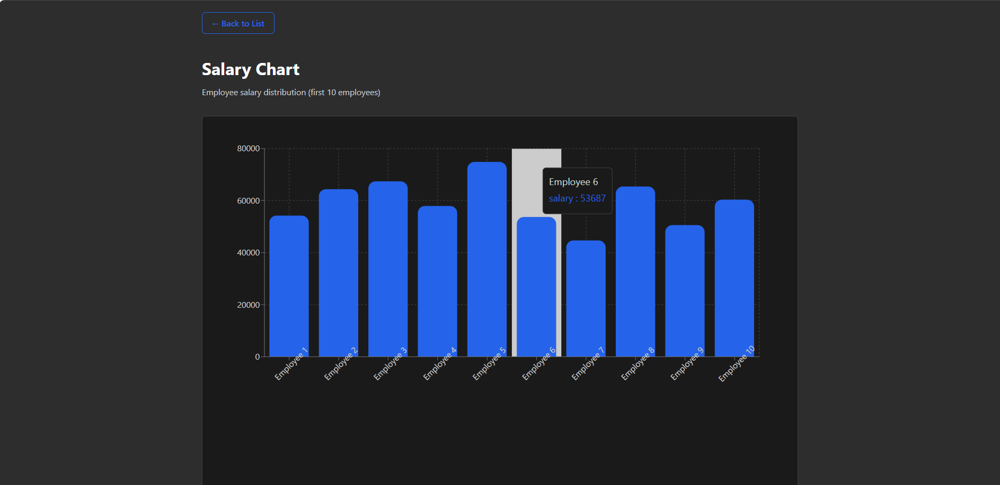

## 📂 Project Structure
# 🌟 Employee Portal – React Application

A simple and clean **Employee Management Portal** built using **React**.  
This application demonstrates login authentication, employee listing, employee details, photo capture, and salary visualization.

---

## 🚀 Features

- 🔐 Login with basic authentication
- 📋 Employee list with salary & city
- 👤 Individual employee details page
- 📷 Camera capture & photo result page
- 📊 Salary bar chart visualization
- 🎨 Dark green modern UI (Lovable-inspired)

---

## 🛠️ Tech Stack

- **Frontend:** React, JavaScript
- **Styling:** CSS / Tailwind-style utility classes
- **Routing:** React Router DOM
- **Charts:** Chart.js / Recharts
- **Version Control:** Git & GitHub

---

## 📸 Application Screenshots

### 🔐 Login Page


### 📋 Employee List


### 👤 Employee Details


### 📷 Photo Result


### 📊 Salary Chart


---

## 📂 Project Structure
src/
├── assets/
│ └── images/
│ ├── login.png
│ ├── employee-list.png
│ ├── employee-details.png
│ ├── photo-result.png
│ └── salary-chart.png
├── components/
├── services/
├── App.jsx
├── main.jsx


---

## ▶️ How to Run the Project

```bash
npm install
npm run dev

Then open:
👉 http://localhost:5173


🔑 Login Credentials (Demo)
Username: testuser
Password: Test123


📌 Notes
This project is built for learning & assignment purposes
Backend is not connected (static / mock data used)
UI inspired by modern dashboard designs
